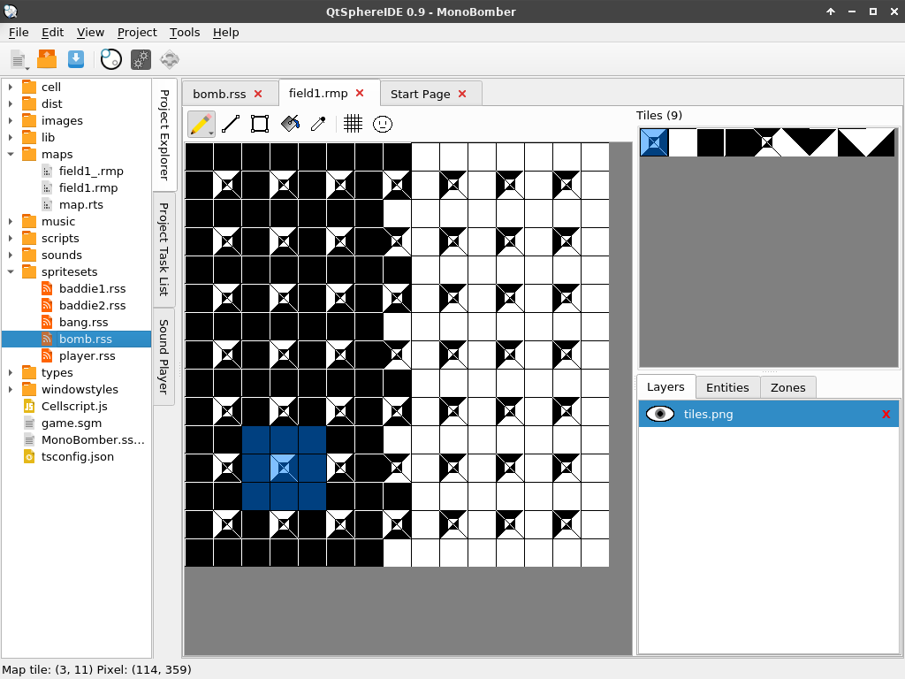

# QtSphere IDE
A cross-platform IDE for the [Sphere game engine](http://spheredev.org)



## Dependencies
* Qt 6
* Python 3
* Qt Creator (optional but recommended for development)
* Qt 6 multimedia module (for the sound player)
	* The package name will vary from Linux distribution to Linux distribution. For example, it's "qt6-multimedia" in Arch Linux and "qtmultimedia6-dev" in Ubuntu.
	* It may or may not come standard for the Windows and macOS Qt package.

## Compilation
Building this in Qt Creator will make things a lot easier and more convenient.

If you want to run it from a terminal, just do:

```Shell
python -m venv env
source env/bin/activate
pip install pyside6
# and for each .ui file:
pyside6-uic ui/form.ui -o ui/ui_form.py
# or alternatively:
pyside2-uic ui/form.ui -o ui/ui_form.py
python mainwindow.py
```
Porting this from C++ to Python is still a work in progress