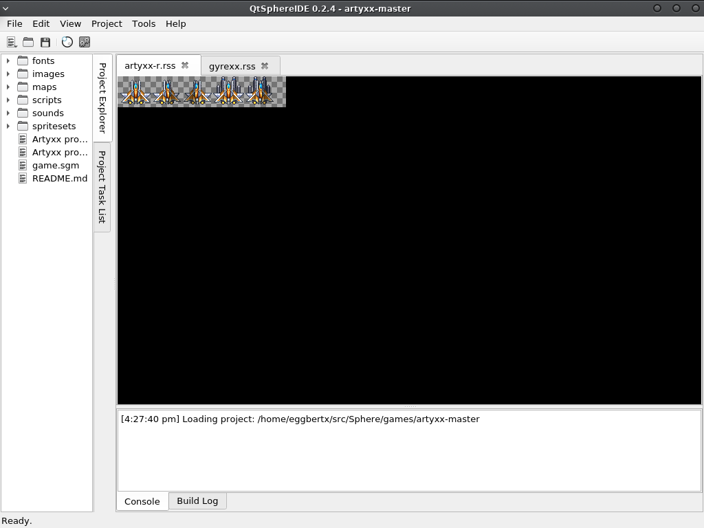

# QtSphere IDE
A cross-platform IDE for the [Sphere game engine](http://spheredev.org)



## Compilation
Building this in Qt Creator will make things a lot easier and more convenient. When you open the QtSphereIDE.pro project file in Qt Creator and it takes you to the .user project creation screen, while it isn't required, setting the build directories to the repository root will make things cleaner. You can ignore the warnings.

If you're weird and insist on using a terminal, just do:

```qmake src/
make
./build/QtSphere```