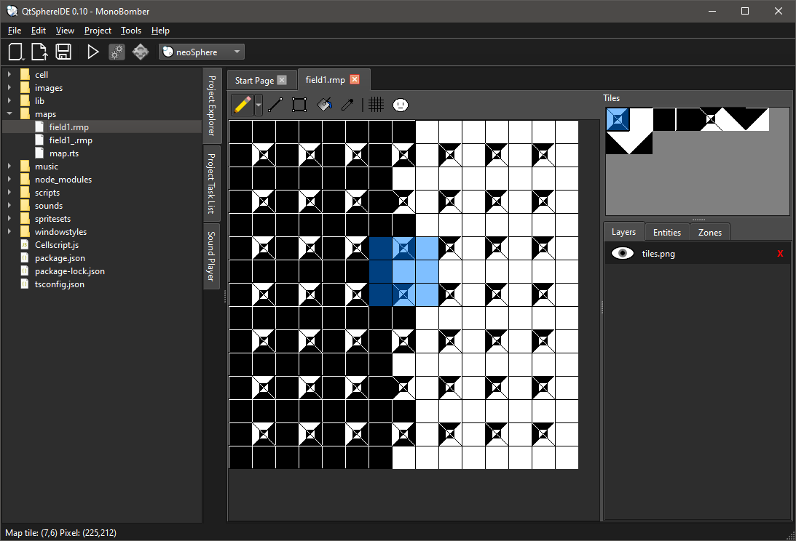

# QtSphere IDE
A cross-platform IDE for the [Sphere game engine](http://spheredev.org)

This project is still a work in progress.



## Dependencies
* Qt 6
* Python 3
* Qt 6 multimedia module (for the sound player)

## Optional dependencies
* Qt Creator (UI development)

## Building
Building this in Qt Creator will make things more convenient, but if you want to run it from the command line, run `python -m venv .venv`.

Then, if you are in Windows, run `.\.venv\Scripts\activate`.

In macOS, Linux, or BSD, run `source .venv/bin/activate`.

Then, run the following:
```
pip install -r requirements.txt
pyside6-project build
python qtsphere-ide.py
```
