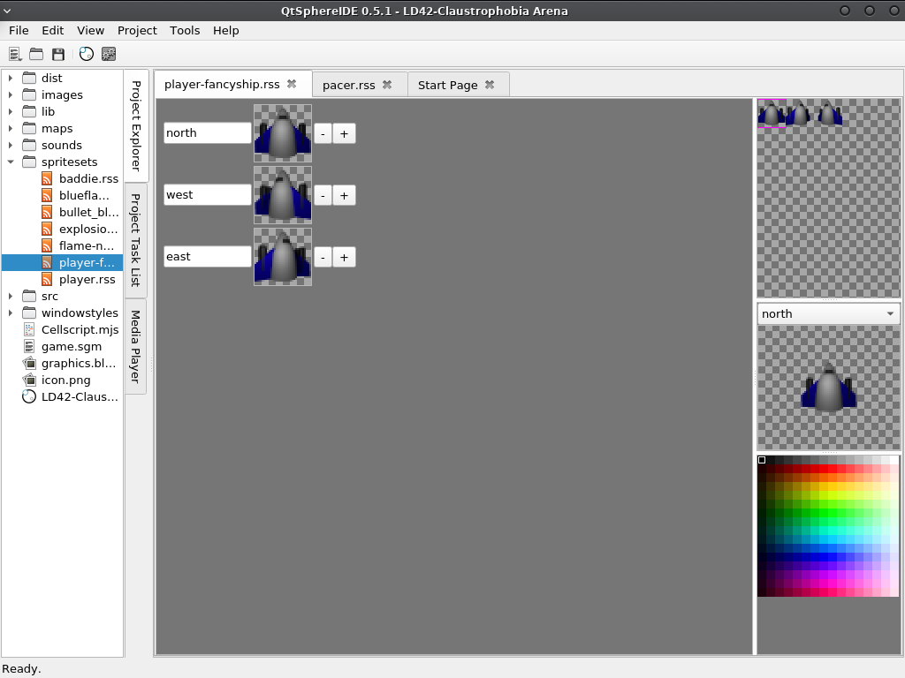

# QtSphere IDE
A cross-platform IDE for the [Sphere game engine](http://spheredev.org)



## Dependencies
* Qt5
* qmake (it may or may not come with Qt5)
* Qt Creator (optional but recommended for development)
* Qt5 multimedia module (for the sound player)
	* The package name will vary from Linux distribution to Linux distribution. For example, it's "qt5-multimedia" in Arch Linux and "qtmultimedia5-dev" in Ubuntu.
	* It may or may not come standard for the Windows and macOS Qt package.

## Compilation
Building this in Qt Creator will make things a lot easier and more convenient. When you open the QtSphereIDE.pro project file in Qt Creator and it takes you to the .user project creation screen, while it isn't required, setting the build directories to the repository root will make things cleaner. You can ignore the warnings.

If you want to build it from a terminal, just do:

```
qmake src/
make
./build/QtSphereIDE
```
